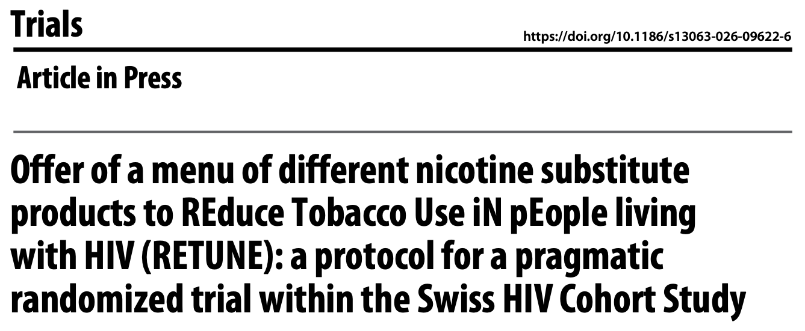
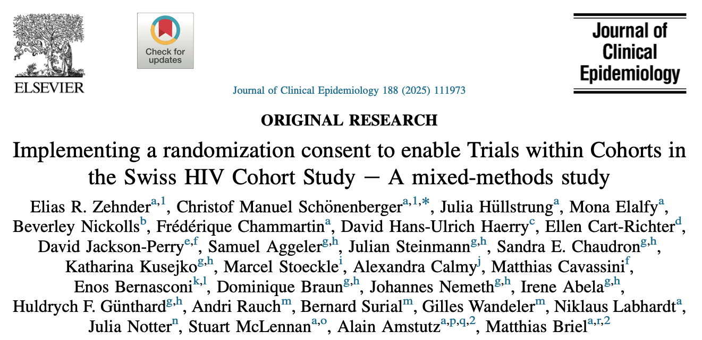

 

 

## "Offer of a menu of different nicotine substitute products to REduce Tobacco Use iN pEople living with HIV (RETUNE): a protocol for a pragmatic randomized trial within the Swiss HIV Cohort Study"

The peer-reviewed publication of the RETUNE trial protocol provides a concise overview of the study design.

 

[{fig-align="center" width="700"}](https://link.springer.com/article/10.1186/s13063-026-09622-6)

 

 

## "Implementing a randomization consent to enable Trials within Cohorts in the Swiss HIV Cohort Study – A mixed-methods study"

The implementation of the TwiCs design, including the roll-out of a randomization consent in an existing, large-scale cohort, is feasible. The acceptance rate among participants was high.

 

[{fig-align="center" width="700"}](https://doi.org/10.1016/j.jclinepi.2025.111973)